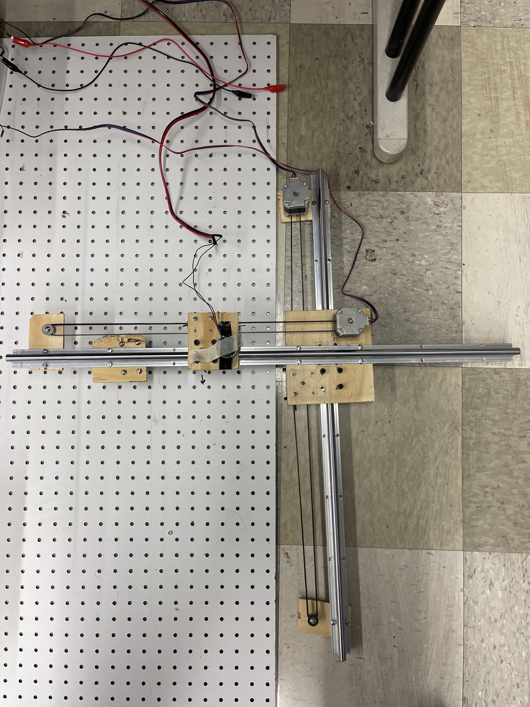
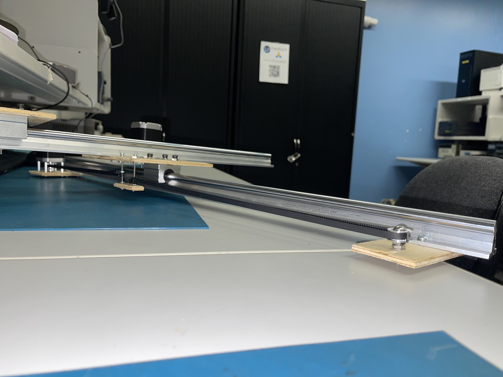
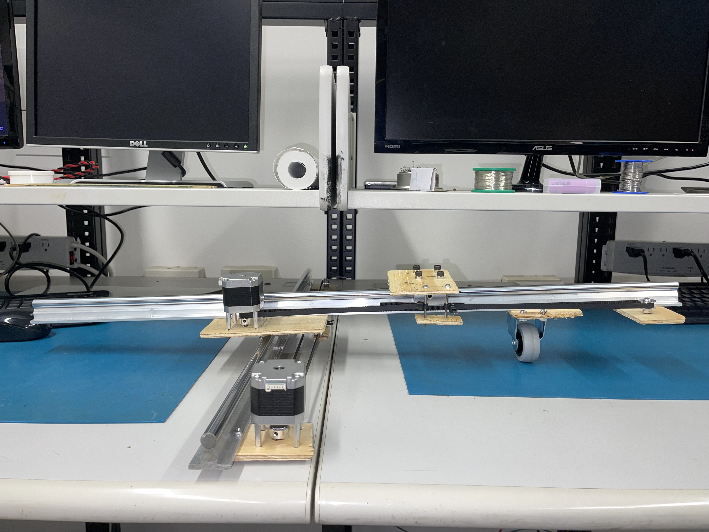
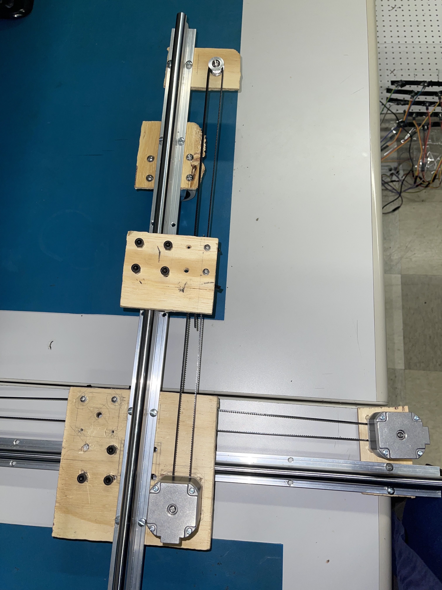
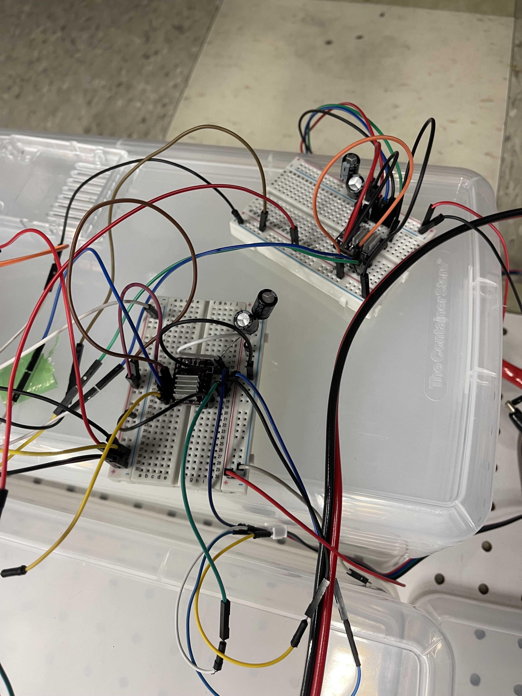
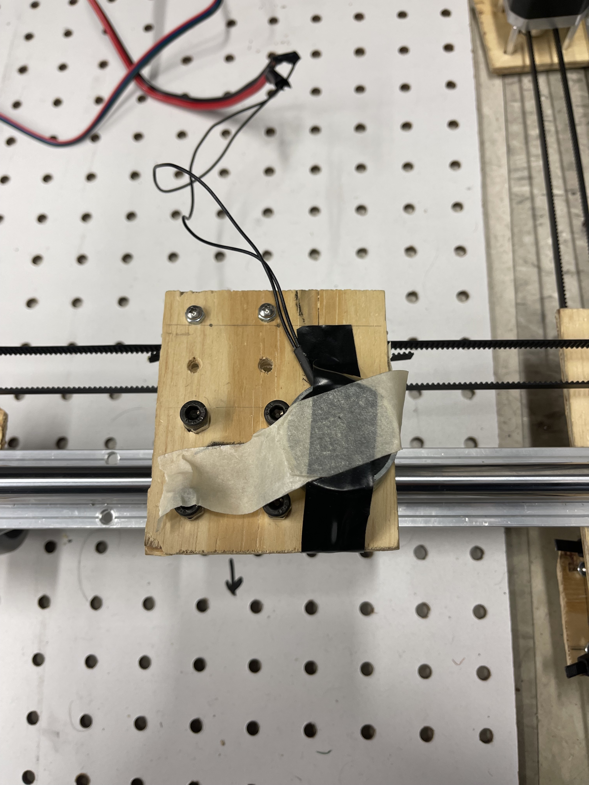
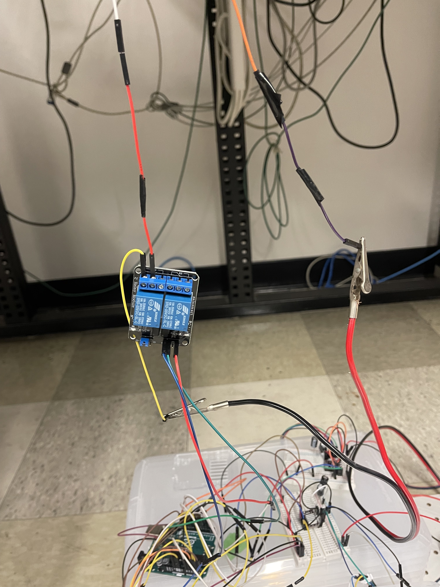
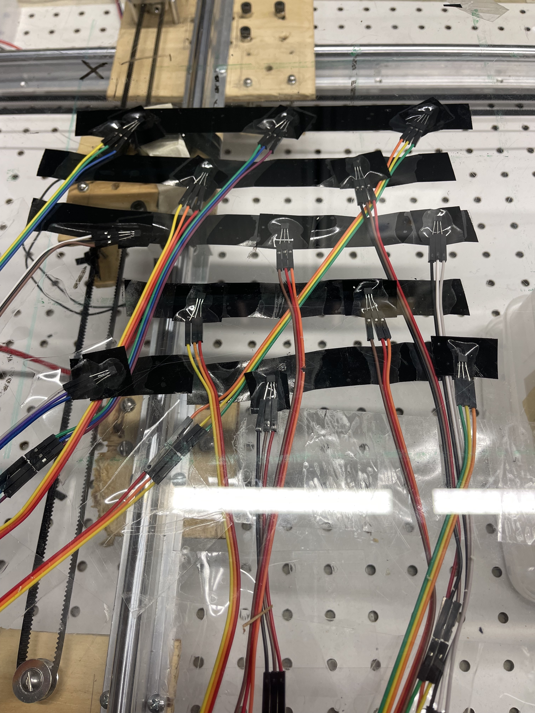

# TicTacTobot
Automated Tic Tac Toe Robot

## Table of Contents
- [Overview](#overview)
- [Features](#features)
- [Installation](#installation)
- [Usage](#usage)
- [Demo](#demo)
- [Contributing](#contributing)
- [License](#license)

## Overview

In this project I showcase my skills in embedded systems engineering by building an automated tic tac toe robot. Topics in this project include mechanical construction, hardware design, and software design. The process of building this project from the ground up was an incredible learning experience. My main takeway from this project is understanding the challenges of integrating hardware with software to create a robust product. 

## Features

Main features in this project include:
- **Cartesian XY T-Gantry system**

- **Stepper Motors to power the gantry**

Wiring the Stepper Motors

- **Electromagent with Two Channel Relay**

Electromagnet Connected to Gantry System

Two Channel Relay Wiring

- **Hall Effect Sensor Grid**

Wiring of the Hall Effect sensors

- **Magnetic Game Pieces**
- **Gameplay logic coded into the Arduino Uno Microcontroller**

## Usage

The stepper motors are used to control the T-gantry system. The electromagnet is connected on top of the gantry so that it can be moved under the game board. The magnet will be switched on and off using the two channel relay to move the magnetic game pieces. The board itself has strategically placed hall effect sensors to detect where game pieces are placed. This data is sent back to the Arduino Uno which keeps track of the board status and programatically determined the CPU's next move which is carried out by the gantry and electromagnet.

### Image Gallery

1. 
2. 
3. 
4. 
5. 
6. 
7. 
8. 
9. 

### Video Demo

Click the thumbnail to watch the demo video.

## Contributing

If you'd like to contribute, please fork the repository and create a pull request.

## License

This project is licensed under the MIT License - see the [LICENSE](LICENSE) file for details.
